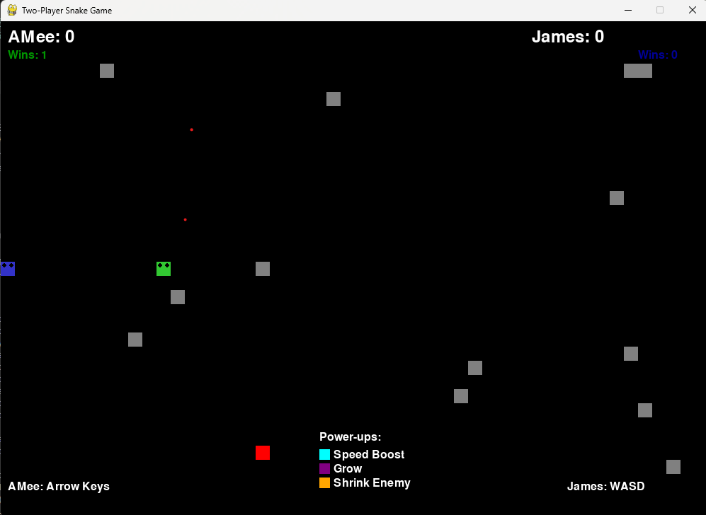
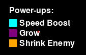

# Snake Game 2 Players

A two-player snake hunting game on the same screen with PyGame graphics!


_Two players competing in an intense snake battle with power-ups and obstacles_

## Features

### 🎮 Basic Gameplay

- **2 Players**: Each player controls their own snake on the same board
- **Player Naming**: Enter names for both players before starting
- **Separate Controls**:
  - Player 1 (Green Snake): Arrow keys
  - Player 2 (Blue Snake): WASD keys
- **Scoring System**: Food +10 points, power-up +5 points
- **Win/Lose**: Snake that survives longest or has highest score wins
- **Score Tracking**: Keep track of wins for each player, +1 win per victory

### ✨ Advanced Features

- **Wall Wrapping**: Touching walls makes you appear on the opposite side (no death)
- **Power-ups**: Three types of special items:
  - 🟦 **Speed Boost** (Blue): Increase speed for 3 seconds
  - 🟣 **Grow** (Purple): Instantly add 2 segments
  - 🟠 **Shrink Enemy** (Orange): Remove 2 segments from opponent
- **Obstacles**: Random gray blocks create challenges
- **Speed Effects**: Snake glows when speed boosted


_Different power-ups: Speed Boost (Blue), Grow (Purple), Shrink Enemy (Orange), plus obstacles_

## Installation

1. **Install Python** (3.7 or higher)
2. **Install PyGame**:
   ```bash
   pip install -r requirements.txt
   ```
   Or manually:
   ```bash
   pip install pygame==2.5.2
   ```

## Running the Game

```bash
python main.py
```

## Controls

### Player 1 (Green Snake)

- **↑**: Move up
- **↓**: Move down
- **←**: Move left
- **→**: Move right

### Player 2 (Blue Snake)

- **W**: Move up
- **S**: Move down
- **A**: Move left
- **D**: Move right

### General Controls

- **R**: Restart game (when game over)
- **N**: Edit player names (when game over)
- **C**: Reset win/loss score (anytime)
- **Q**: Quit game

### Name Input Controls

- **Enter**: Confirm current name
- **Tab**: Switch to next player
- **Space**: Start game with current names
- **C**: Reset win/loss score
- **Backspace**: Delete character
- **ESC**: Start with default names / Go back

## How to Play

1. **Enter Names**: Set names for both players before starting
2. **Objective**: Survive longer than your opponent and score more points
3. **Eat Food**: Red squares give 10 points and make your snake grow
4. **Collect Power-ups**: Colored squares provide temporary advantages:
   - Blue = Speed boost for 3 seconds
   - Purple = Instantly add 2 segments
   - Orange = Remove 2 segments from opponent
5. **Avoid Collisions**: Don't hit obstacles, yourself, or your opponent
6. **Win Conditions**:
   - Last surviving snake wins
   - If both die simultaneously, higher score wins
   - Tie if same score when both die
7. **Overall Score**: Each victory accumulates +1 win, displayed on screen

## Game Mechanics

### Collision System

- **Wall Wrapping**: Touch screen edge → appear on opposite side (no death)
- **Self Collision**: Hit your own body → death
- **Player Collision**: Hit opponent's body → death
- **Head-to-Head**: Two heads collide → both die
- **Obstacles**: Hit gray blocks → death

### Scoring System

- **Food**: 10 points per red square (round score)
- **Power-ups**: 5 bonus points per item (round score)
- **Survival Bonus**: Being the last snake alive usually determines winner

### Score Tracking

- **Round Win**: +1 win for victor (cumulative display)
- **Tie**: No one gets win point
- **Reset**: Can reset score to 0-0 with C key

### Power-up Effects

- **Speed Boost**: Double speed for 3 seconds (glowing effect)
- **Grow**: Instantly add 2 body segments
- **Shrink Enemy**: Remove up to 2 segments from opponent (won't kill)

## Strategy

1. **Control the Center**: Middle positions have more escape routes
2. **Use Power-ups Wisely**: Speed boost helps escape dangerous situations
3. **Block Opponent**: Use your body to limit opponent's movement
4. **Avoid Head-on Collisions**: Don't charge directly at each other
5. **Exploit Wall Wrapping**: Use wrap-around feature for surprise attacks

## Technical Details

- **Interactive Interface**: Name input screen with real text input
- **State Management**: Transitions between name input, playing, game over
- **Grid Movement**: 20x20 pixel grid system
- **Smooth Animation**: 60 FPS
- **Random Generation**: Obstacles and power-ups spawn randomly
- **Real-time Controls**: Continuous input processing
- **Collision Optimization**: Efficient position-based collision detection

## Customization

You can modify constants in the game files:

- `WINDOW_WIDTH/HEIGHT`: Change board size
- `GRID_SIZE`: Adjust movement granularity
- `base_speed`: Modify base snake speed (smaller number = faster)
- `powerup_spawn_interval`: Control power-up frequency
- Colors and effects can be customized in the color constants section

Have fun playing! 🐍🎮
